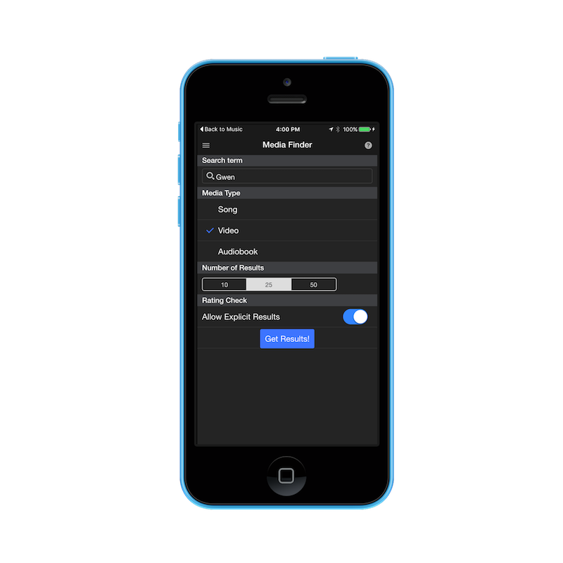
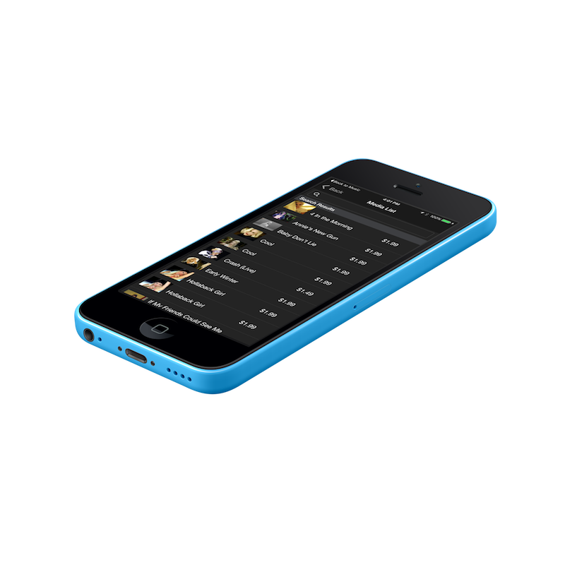
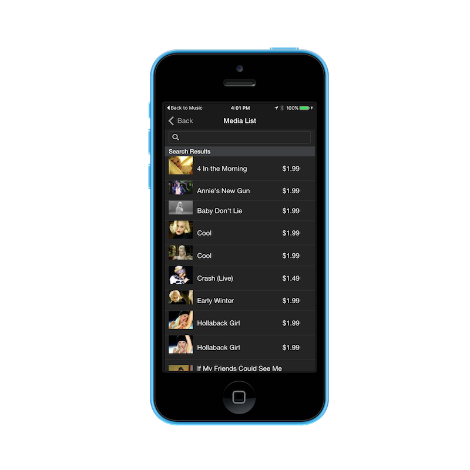
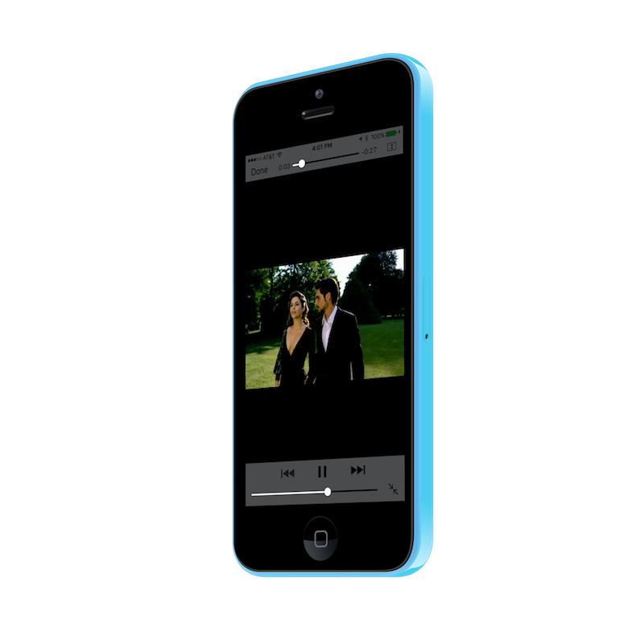

iTunes Media Finder Sample PhoneGap App Using Onsen 2 / AngularJS
=================================================================
- Demonstrates how to use Onsen 2 with AngularJS to create a hybrid mobile app.
- Search for songs, videos and audio books using the app and instantly preview them in your app.
- Shows a basic app template including a sliding side menu and modal component use. 
- Specifies a set of icons and splash screens in the config.xml for iOS and Android

