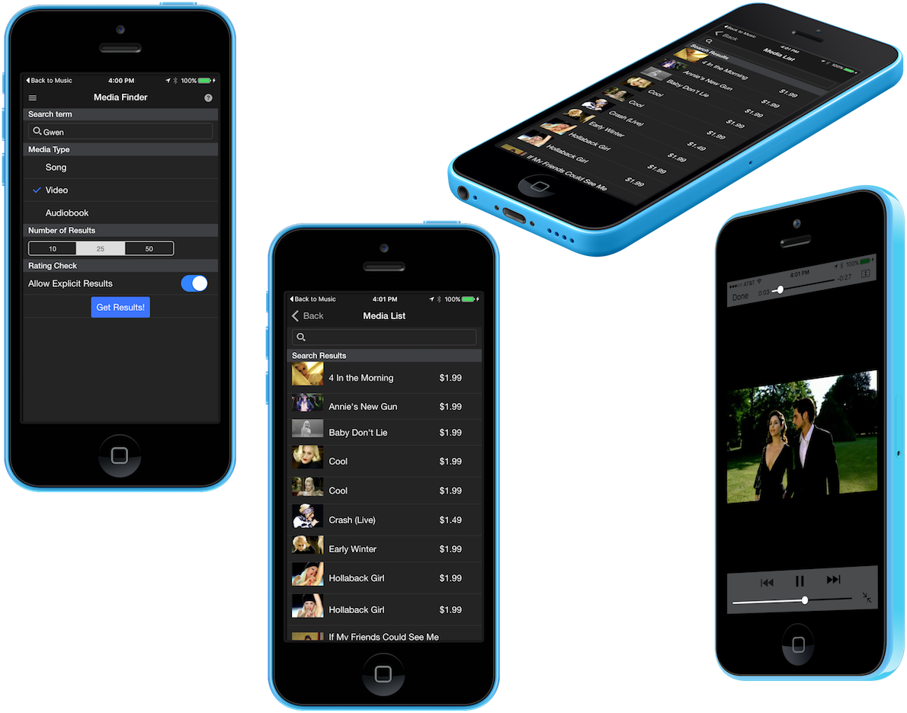

iTunes Media Finder Sample - Onsen 2 / AngularJS
=================================================================
- Demonstrates how to use Onsen 2 with AngularJS and PhoneGap to create a hybrid mobile app.
- Search for songs, videos and audio books using the app and instantly preview them in your app.
- Shows a basic app template including a sliding side menu and modal component use. 
- Specifies icons, splash screens, preferences and plugins etc in the config.xml for iOS and Android.

### Quick Start
1. Create a phonegap project using the [PhoneGap Desktop Application](https://github.com/phonegap/phonegap-app-desktop) or the PhoneGap CLI  
    `$ phonegap create myApp`
2. Clone/download this project 
3. Copy the following from this project into to your newly created app project (overwriting the existing)
  - `www` folder 
  - `config.xml` file 
  - `resources` folder for the custom icons and splash screens to be used.   
4. Start the server for your app using the PhoneGap CLI ((`$ phonegap serve`) or [PhoneGap Desktop Application](https://github.com/phonegap/phonegap-app-desktop) 
5. Open the PhoneGap Developer app on your mobile device (available from app stores) and connect to the IP Address your app was served on. 

See the [PhoneGap Docs Quick Start](http://docs.phonegap.com/getting-started/2-install-mobile-app/) for more details on this process.
 
 
###Use with the PhoneGap CLI
1. Create a PhoneGap base project
        
        $ phonegap create mediaApp
 
2. Copy the resources from this repo into your project, replacing the www folder and config.xml with this one.    
    
3. cd into the root of your project and run it with your desired platform 
    
        $ phonegap run ios

###Use with the Cordova CLI
1. Create a PhoneGap base project
    
        $ cordova create mediaApp
    
2. Copy the resources from this repo into your project, replacing the www folder and config.xml with this one.
    
3. cd into the root of your project add the desired platform
    
        $ cordova platform add ios

4. Run it with your desired platform
 
        $ cordova run ios
